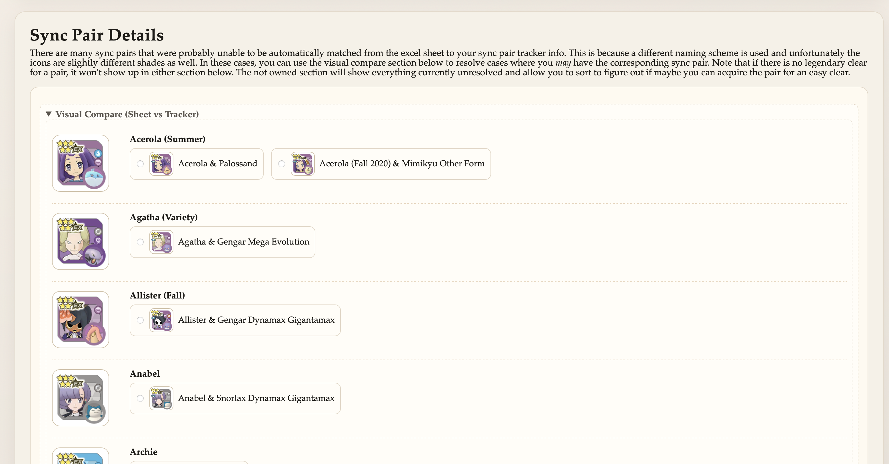
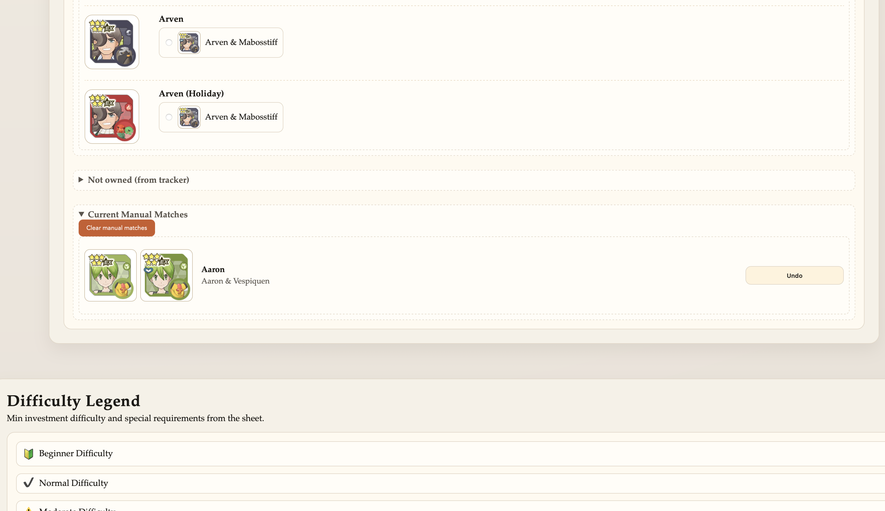

# Gauntlet Planner

Quick start:

```bash
node setup-gauntlet.js \
  --xlsx "/path/to/PoMa Legendary Arena Solos & Info.xlsx" \
  --pairs "/path/to/my_pairs.json"

cd gauntlet-planner
python3 -m http.server 8000
```

This app combines your SyncPairsTracker export with the community Legendary Gauntlet spreadsheet (XLSX extract) to build a plan and show per‑boss clear details.

## Prerequisites
- Node.js (for the setup script)
- Python 3
- `openpyxl` installed in your Python environment
  - If you use conda, a `poke` env is supported by the setup script.
  - If you pass `--python`, the Python you provide must have `openpyxl` installed.

## 1) Get Your Sync Pairs Export
1. Open SyncPairsTracker.
2. Use its Export function to copy your JSON.
3. Save the JSON to a file (example: `my_pairs.json`).

## 2) Download the XLSX
Download the community spreadsheet as XLSX (not CSV). You need the full Excel file so images and per‑boss sheets are available.

## 3) Run Setup
From the repository root:

```bash
node setup-gauntlet.js \
  --xlsx "/path/to/PoMa Legendary Arena Solos & Info.xlsx" \
  --pairs "/path/to/my_pairs.json"
```

If your Python isn’t on `PATH`, you can provide it:

```bash
node setup-gauntlet.js \
  --xlsx "/path/to/PoMa Legendary Arena Solos & Info.xlsx" \
  --pairs "/path/to/my_pairs.json" \
  --python "/path/to/python"
```

This will:
- Copy SyncPairsTracker assets into `gauntlet-planner/`
- Copy your export to `gauntlet-planner/my_pairs.json`
- Generate `gauntlet-planner/clears_from_xlsx.json`
- Extract sheet images into `gauntlet-planner/clears_images/`

Tracker inputs (XLSX + SyncPairsTracker export):


## 4) Run the App
From `gauntlet-planner/`:

```bash
python3 -m http.server 8000
```

Open [http://localhost:8000](http://localhost:8000) in your browser.

## 5) Load Data
In the app:
- Click **Load XLSX Extract**.
- Your sync pairs load automatically from `my_pairs.json`.

Plan output:


Visual compare (manual matching):



Manual selection undo list:



## Updating Data
- New XLSX or new sync pairs export? Re‑run the setup script.
- If you want to keep a separate export file, just rerun setup with the new paths.

## Troubleshooting
- If images are missing, make sure the XLSX is the full file (not CSV).
- If `openpyxl` is missing, install it in your Python env.
- If you use conda, create or install `openpyxl` in env `poke`.

## Files Created
- `gauntlet-planner/vendor/syncpairs.js`
- `gauntlet-planner/icons/`
- `gauntlet-planner/my_pairs.json`
- `gauntlet-planner/clears_from_xlsx.json`
- `gauntlet-planner/clears_images/`
